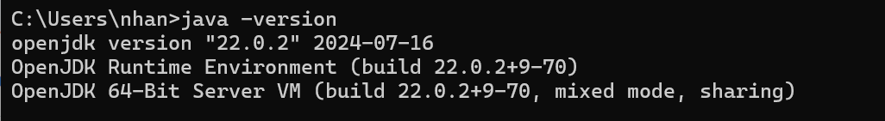
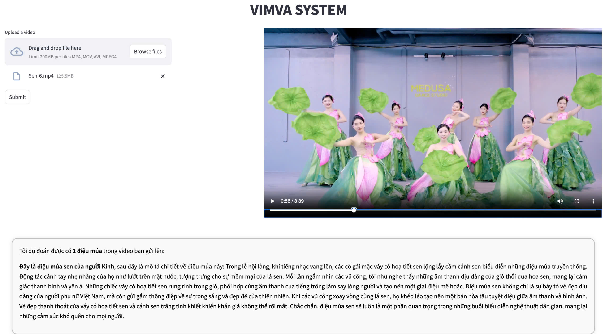
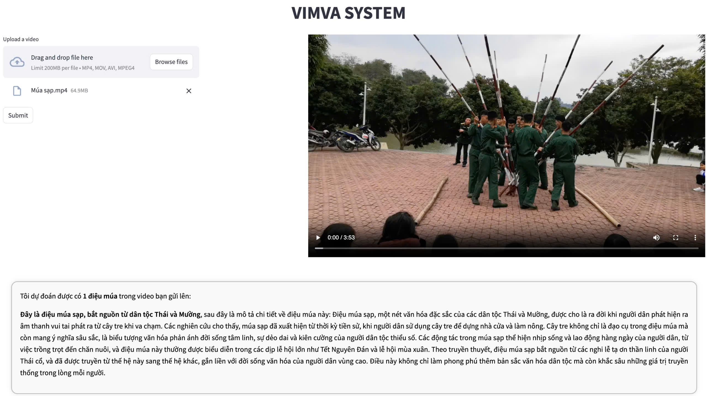
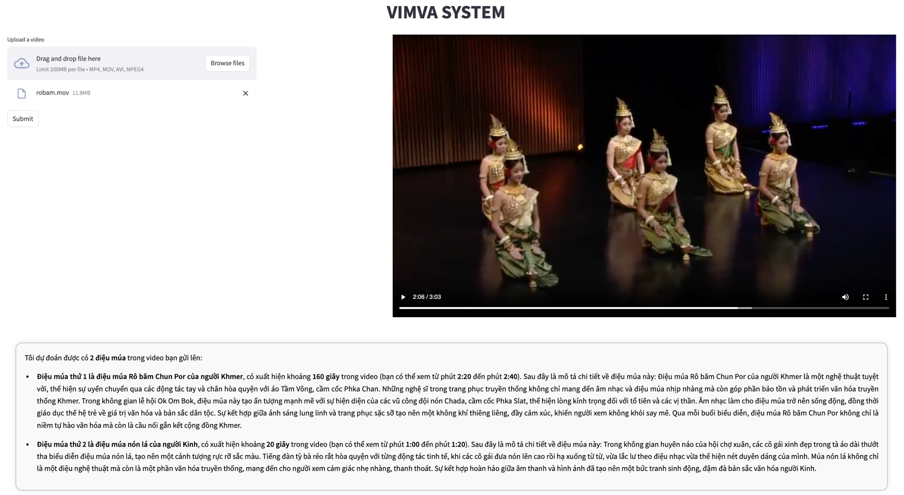

VIMVA: Innovative Multimodal Recognition in
Vietnamese Folk Dance Video Analysis

Attached Into The paper For The Camera Version

# Introduction:
*we propose an innovative approach to analyzing and characterizing dance performances by converting visual data
into a text-based classification and description framework. Our method
entails extracting key features from dance videos and converting these
features into textual representations. These text-based features are then
used to predict and describe the specific dance style depicted in the video.
By shifting from traditional computer vision tasks to text retrieval and
classification, we significantly enhance the interpretability and contextual
understanding of dance performances. Our experimental results indicate
a commendable accuracy rate exceeding 86%, highlighting the effectiveness of our approach in both predicting dance styles and generating
insightful descriptions. Additionally, our method provides transparent
explanations for prediction outcomes, offering valuable insights into the
distinctive characteristics of various dance forms.*
# Requirement:
## Library:
#### 1. To cut video and extract frame:
```
     pip install moviepy
```
#### 2. To download, train and use YOLO model:
```
     pip install ultralytics
```
#### 3. To download and use VnCoreNLP:
```
    pip install py_vncorenlp
```
To use VnCoreNLP, your computer must have JVM (Java Virtual Machine) installed. You can check if it is installed with this command in your **Command Prompt**:
```
     java -version
```
If it is installed, the result should look like this:

Otherwise, you can download JVM at link: https://www.oracle.com/java/technologies/downloads/#java8
#### 4. To download, train and use PhoBERT model:
```
     pip install transformers torch
```


# Train Model:
### 1. YOLO Model:
First, you need to prepare a labeled images dataset. You can use [Roboflow](https://app.roboflow.com/) for this. Then, download the dataset that is suitable for **YOLO-v9**.<br>
Second, you can use [Kaggle](https://www.kaggle.com/) or Colab of Google to train the YOLO-v9s model, as it requires a GPU to run and process. Below is the command for downloading and training model:
```
!yolo task=detect mode=train model=yolov9s.pt epochs=30 batch=32 data=path/to/dataset.yaml imgsz=480
```
Replace ```path/to/dataset.yaml``` with the path to your dataset's .yaml file.<br>
Next, you should download your model to your computer for later use.

### 2. PhoBERT Model:
First, you need to prepare a labeled texts dataset. It has two columns: ***texts*** and ***labels***. The ***texts*** column includes sentences that contain keywords related to their labels. Each row should contain only one sentence. <br>
Second, you can use some preprocessing methods for NLP to preprocess your dataset *(VnCoreNLP is one of these steps)*. <br>
Next, you can download the model with the commands below:
```
from transformers import AutoTokenizer, AutoModelForSequenceClassification
model_name = 'vinai/phobert-base-v2'
tokenizer = AutoTokenizer.from_pretrained(model_name)
model = AutoModelForSequenceClassification.from_pretrained(model_name)
```
After that, the model is ready for training *(using a GPU is recommended)*. Finally, you should save the model *(for later use)* with the commands:
```
tokenizer.save_pretrained('your_model_path_dir')
model.save_pretrained('your_model_path_dir')
```
Replace ```your_model_path_dir``` with the path to save your model.

# Results:
***Video 1:*** <br>
**True Label**: *"Điệu múa sen của người Kinh"* <br>
**Predicted Labels**: *"Điệu múa sen của người Kinh"*
 <br>

***Video 2:*** <br>
**True Label**: *"Điệu múa sạp của người Thái, Mường"* <br>
**Predicted Labels**: *"Điệu múa sạp của người Thái, Mường"*
 <br>

***Video 3:*** <br>
**True Label**: *"Điệu múa Rô băm Chun Por của người Khmer"* <br>
**Predicted Labels**: <br>
*1. "Điệu múa Rô băm Chun Por của người Khmer"* appears for 160 seconds in the video. <br>
*2. "Điệu múa nón lá của người Kinh"* appears for 20 seconds in the video. <br>
Therefore, we conclude that the label *"Điệu múa Rô băm Chun Por của người Khmer"* has higher confidence because it appears more frequently in the video than the other label.
 <br>


